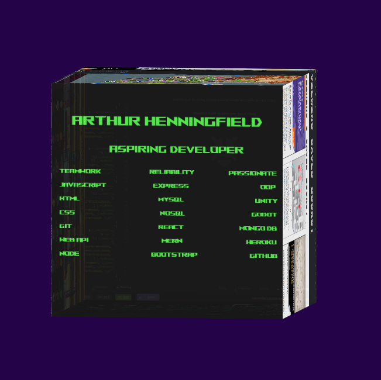

# Portfolio
  ## Description
  A professional portfolio of Arthur Henningfield
  
  ## Table of Contents

  [Installation](#installation)
  
  [Usage](#usage)
  
  [Links](#links)
  
  [Contributing](#contributing)
  
  [Questions](#questions)

  ## Installation
  Clone and add in your own information if you enjoy the design! Completed with React in Node.JS Environment.

  ## Links
  Quick links found within the rotating cube
  * Employee Tracker Repo [https://github.com/kylatae/employee_tracker](https://github.com/kylatae/employee_tracker)
  * Robot Murder Mystery Game [https://franklinbrad.github.io/robot-murder-mystery/](https://franklinbrad.github.io/robot-murder-mystery/)
  * Saleblazers Wikipedia at Fandom [https://saleblazers.fandom.com/wiki/Saleblazers_Wiki](https://saleblazers.fandom.com/wiki/Saleblazers_Wiki)
  * Save a Book GraphQL Conversion [https://kylatae-save-a-book-a485871b6375.herokuapp.com/](https://kylatae-save-a-book-a485871b6375.herokuapp.com/)
  * Social Network Backend using Mongoose [https://github.com/kylatae/social-network/tree/main/assets](https://github.com/kylatae/social-network/tree/main/assets)
  
  ## Contributing
  If you have any suggestions as to how to better present this resume please feel free to contact me and send in suggestions!

  ## Questions
  Contact me using my github page at https://www.github.com/kylatae or email at kylatae@gmail.com

  ## Preview Page

Repo Link:[https://github.com/kylatae/portfolio](https://github.com/kylatae/portfolio)
Deployed Link: [https://kylatae-portfolio-ca80c1335e69.herokuapp.com/](https://kylatae-portfolio-ca80c1335e69.herokuapp.com/)
